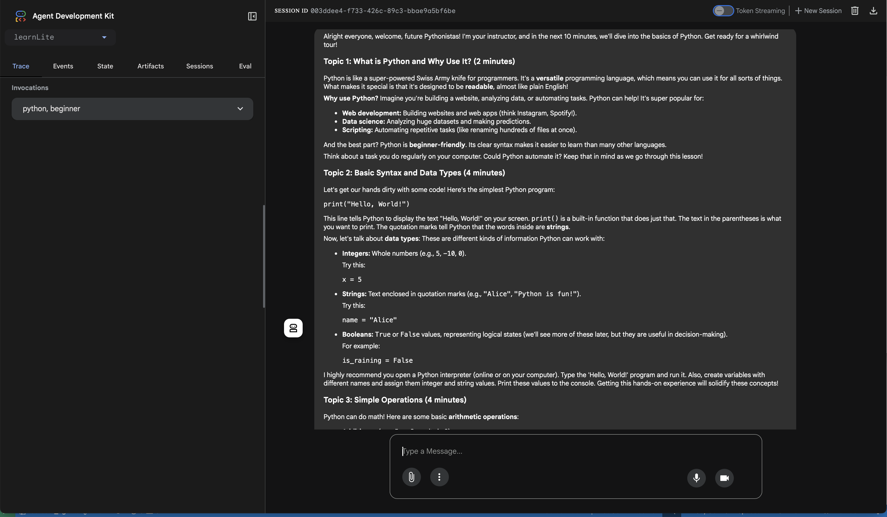
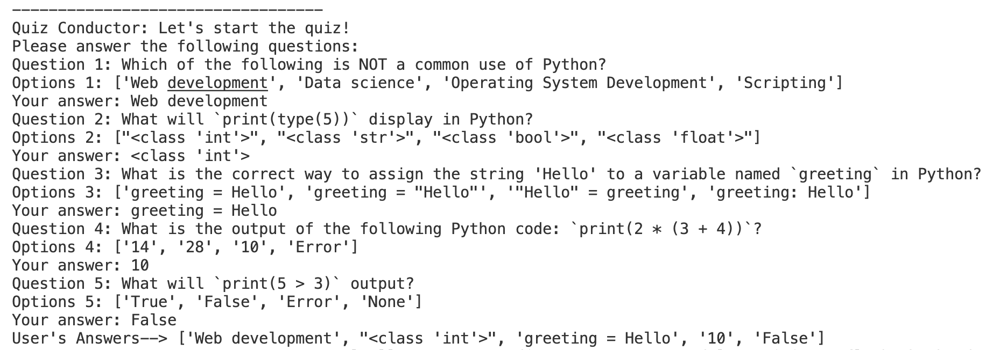
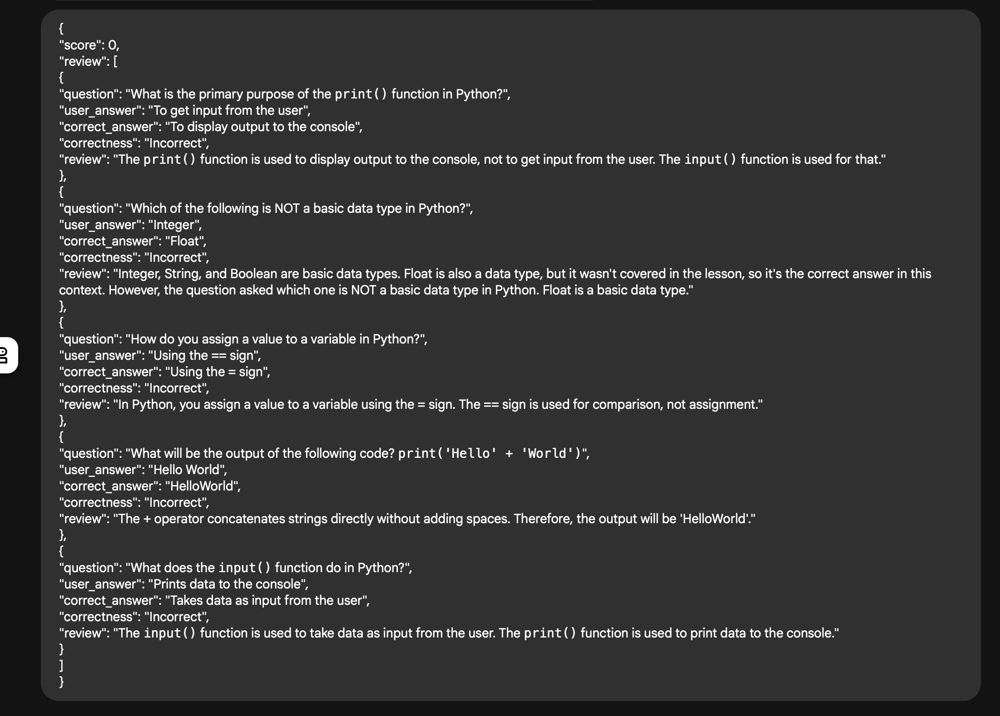

# LearnLite Quiz Workflow
This repository contains an agent-based system designed to create a dynamic learning and quizzing experience. It leverages a series of interconnected agents to plan a curriculum, generate course content, act as an instructor, create quizzes, conduct them, and finally evaluate user responses.

## 1. Features
1. **Curriculum Planning**: Automatically generates a learning curriculum based on a given topic.
2. **Course Content Generation**: Creates comprehensive course material for the planned curriculum.
3. **Interactive Instruction**: An instructor agent delivers the course content in an engaging, lesson-like format.
4. **Quiz Generation**: Develops multiple-choice quizzes with questions, options, and correct answers.
5. **Quiz Conduction**: Guides the user through the quiz, collects answers, and stores them.
6 **Automated Evaluation**: Compares user answers against correct ones, provides correctness feedback, individual question reviews, and a total score summary.  

## 2. Key Agents

The system is composed of the following sequential agents:

- **CurriculumPlanner**: Plans the learning curriculum for a specified topic.
- **CourseContentCreator**: Generates detailed course content based on the curriculum.
- **Instructor**: Presents the generated course content as an interactive lesson.
- **QuizMaker**: Creates a quiz with questions, options, and correct answers from the course content.
- **QuizConductor**: Manages the quiz flow, prompts the user for answers, and collects their responses.
- **QuizEvaluator**: Assesses the user's performance on the quiz, providing scores and detailed feedback.

## 3. Setup and Installation
### Prerequisites
- Python > 3.9
- google-generativeai library (or similar, depending on the google.adk dependency)
- python-dotenv (for managing API keys)
- pydantic
- json_repair
 

### Installation
1. Clone the repository:
```
git clone <your-repository-url>
cd <your-repository-name>
```

2. Install Dependencies:
```
pip install -r requirements.txt
```

3. Set up environment variables:
```
GOOGLE_GENAI_USE_VERTEXAI=FALSE
GOOGLE_API_KEY=<your-api-key>
GOOGLE_GENAI_MODEL="gemini-2.0-flash"
```


### How to run
1. To run the LearnLite Quiz Workflow, run below command from path ```<your-directory>/fourcast_agents```:
```
adk web
```
2. Select ```learnLite``` from the dropdown on the left and enter ```google agent development kit (or anything of your interest), Beginner``` in the chat-box.

3. The course_content_creator and instructor will work together to conduct a class. You are then prompted to take a small quiz. The answers should be filled in using your Terminal.

4. Once all the questions are answered, the loop stores your response and triggers the evaluation_agent which provides a score and a review. 

### sample outputs



